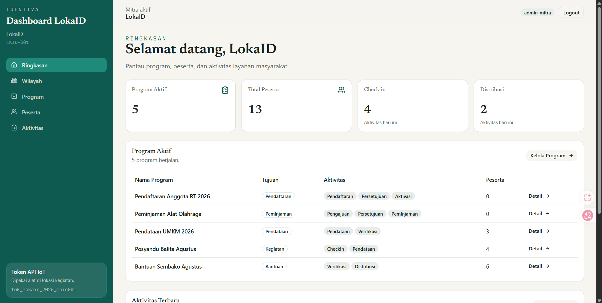
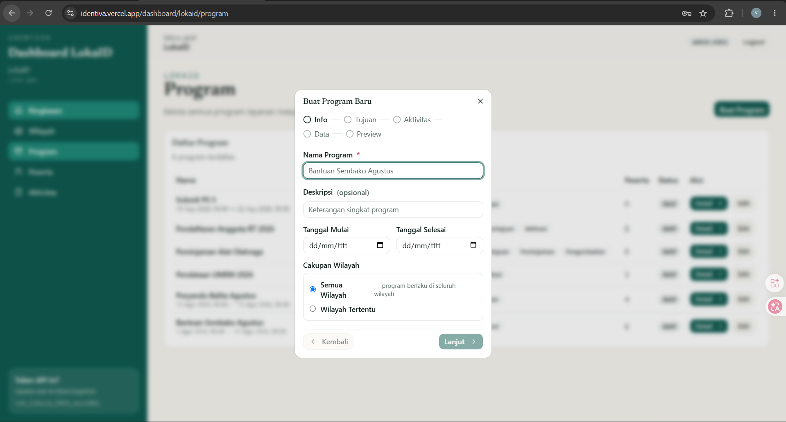
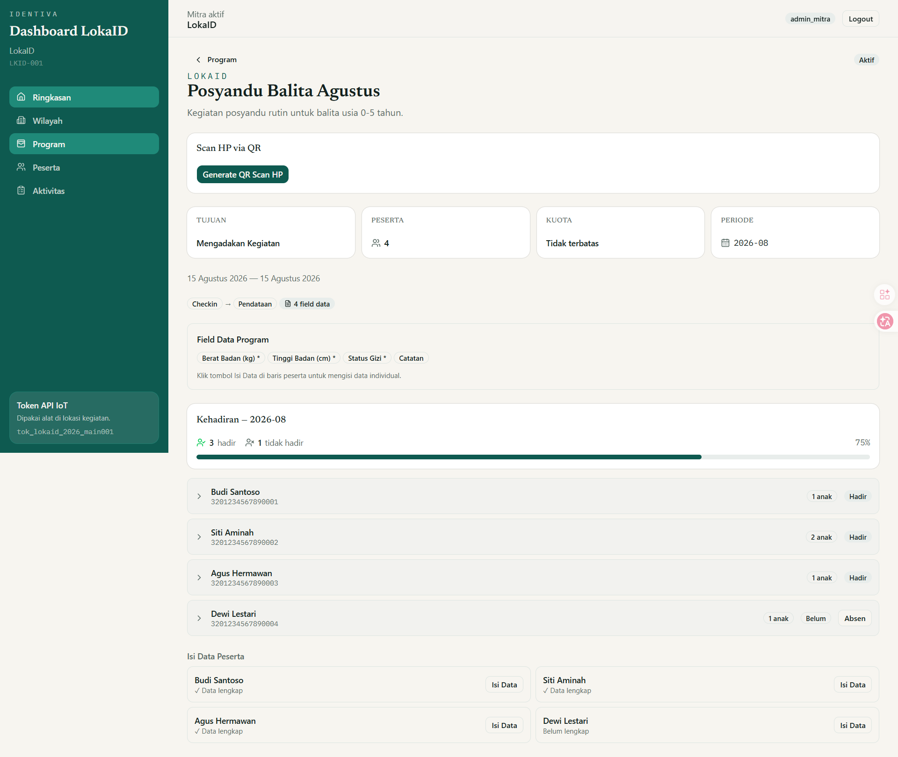
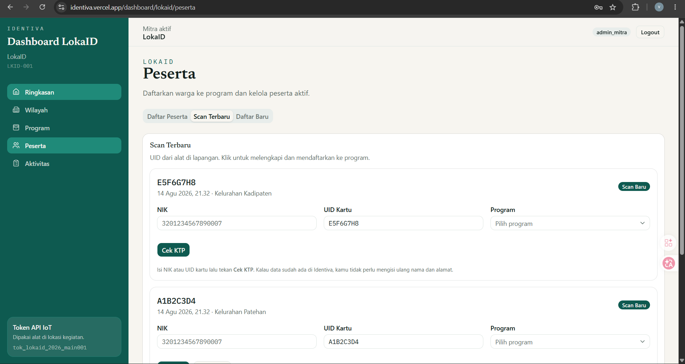
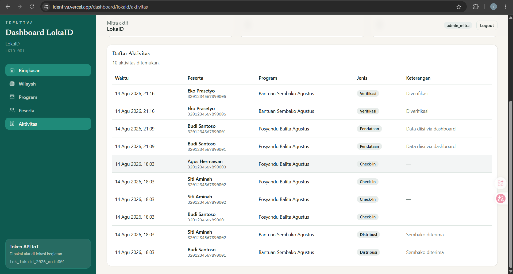
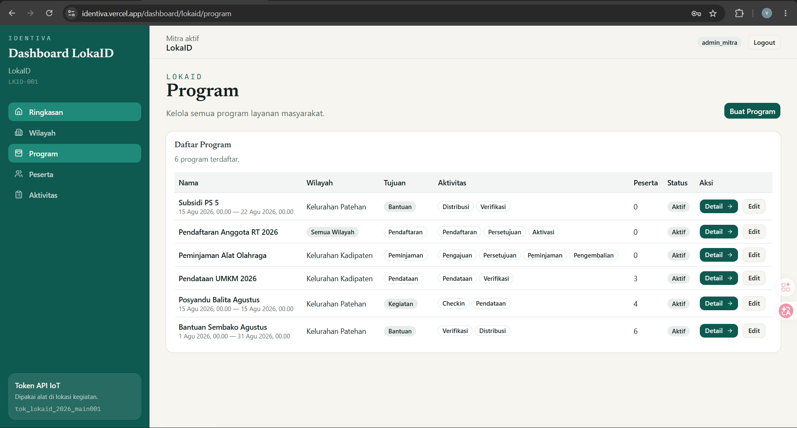
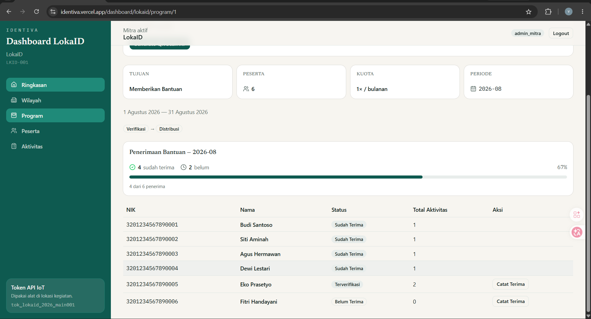

/mod.ee# LokaID: Platform Layanan Masyarakat Lokal Berbasis Identitas Digital dan IoT

**Tim:** SOEPATMEN  
**Anggota:** Afriza Marshal Verdiasta, Rio Ardiansyah, Virgie Herwan Zakka Shaputra  
**Instansi:** Universitas Mercu Buana Yogyakarta  
**Tahun:** 2026

---

## DAFTAR ISI

1. Deskripsi Singkat Ide
2. Latar Belakang
3. Tujuan dan Manfaat Ide
4. Batasan dan Sasaran Pengguna
5. Analisis
6. Implementasi dan Cara Kerja
7. Desain
8. Daftar Pustaka
9. Lampiran

---

## 1. DESKRIPSI SINGKAT IDE

LokaID adalah platform layanan masyarakat lokal berbasis identitas digital dan IoT yang membantu kelurahan, desa, komunitas, dan unit layanan membuat program secara dinamis tanpa membangun aplikasi baru dari awal. LokaID memanfaatkan **Identiva** sebagai fondasi identitas warga, sehingga satu Citizen ID dapat digunakan untuk berbagai layanan seperti Posyandu Balita, Bansos Sembako, Pendataan UMKM, Peminjaman Fasilitas, dan kegiatan masyarakat lain.

Masalah utama yang ingin diselesaikan adalah proses layanan lokal yang masih banyak dilakukan secara manual. Pendataan warga sering berulang, data peserta tercecer, rekap aktivitas sulit dilakukan, dan setiap jenis program membutuhkan format pencatatan yang berbeda. LokaID menjawab masalah tersebut dengan menyediakan Program Wizard, Form Builder, sistem peserta berbasis identitas, pencatatan aktivitas, dashboard admin, serta integrasi perangkat IoT untuk verifikasi lapangan.

Dalam implementasinya, LokaID terhubung dengan perangkat RFID/NFC berbasis ESP32 melalui koneksi USB Serial atau Bluetooth ke bridge PC. Petugas lapangan memindai Citizen ID warga pada alat untuk verifikasi, pendaftaran peserta, check-in kegiatan, distribusi bantuan, atau pencatatan aktivitas lainnya. HP NFC menjadi alternatif opsional untuk operasional lapangan pada pengembangan lanjutan. Data yang masuk akan tersimpan di sistem web, kemudian dapat dipantau melalui dashboard oleh admin wilayah maupun admin induk.

Fokus demo utama proposal ini adalah **Posyandu Balita**. Pada skenario tersebut, wali memiliki Citizen ID, anak didaftarkan sebagai dependent, lalu petugas dapat melakukan check-in dan mengisi data kesehatan seperti berat badan, tinggi badan, dan catatan kesehatan. Sebagai pembanding, LokaID juga dapat digunakan untuk Bansos Sembako, yaitu mencatat peserta penerima bantuan dan status distribusi.

Dengan pendekatan ini, LokaID tidak hanya menjadi aplikasi satu fungsi, tetapi menjadi platform layanan lokal yang fleksibel. Identiva menyediakan identitas digital, sedangkan LokaID menjalankan program-program lokal berbasis identitas tersebut. Integrasi IoT membuat proses verifikasi di lapangan menjadi lebih cepat, terarah, dan terdokumentasi.

---

## 2. LATAR BELAKANG

Layanan masyarakat lokal seperti posyandu, bansos, pendataan UMKM, kegiatan warga, dan peminjaman fasilitas masih sering dilakukan menggunakan kertas, spreadsheet, atau formulir sederhana. Cara tersebut mudah dilakukan pada skala kecil, tetapi menimbulkan masalah ketika jumlah peserta bertambah, program berjalan rutin, dan data harus direkap lintas wilayah.

Salah satu permasalahan yang sering muncul adalah **data warga yang berulang**. Warga yang sudah pernah mengikuti program tertentu sering harus didata ulang pada program lain. Misalnya, seorang ibu yang sudah terdaftar pada kegiatan posyandu tetap harus mengisi data ulang ketika mengikuti program bansos atau pendataan warga. Hal ini memperlambat kerja petugas dan meningkatkan risiko kesalahan data.

Selain itu, setiap layanan lokal memiliki kebutuhan data dan alur yang berbeda. Program Posyandu Balita membutuhkan data anak, wali, check-in, berat badan, dan tinggi badan. Program Bansos Sembako membutuhkan data penerima, verifikasi kelayakan, dan status distribusi. Program Peminjaman Fasilitas membutuhkan pengajuan, persetujuan, peminjaman, dan pengembalian. Jika setiap kebutuhan dibuat menjadi aplikasi terpisah, maka pengembangan menjadi mahal dan sulit dipelihara.

Permasalahan lain adalah verifikasi peserta di lapangan. Petugas sering harus mencari data manual atau mencocokkan identitas secara langsung. Proses ini lambat dan sulit diaudit. Dengan adanya Citizen ID berbasis RFID/NFC, proses verifikasi dapat dilakukan lebih cepat melalui pemindaian kartu pada alat pembaca. Sistem dapat mengecek apakah warga sudah terdaftar, mengikuti program tertentu, atau memiliki aktivitas yang perlu dicatat.

Berdasarkan permasalahan tersebut, LokaID dirancang sebagai platform dinamis yang dapat digunakan untuk berbagai program lokal. LokaID tidak mengunci pengguna pada satu jenis layanan. Admin dapat membuat program melalui Program Wizard, menentukan sasaran peserta, menambahkan data khusus melalui Form Builder, memilih aktivitas program, dan mencatat pelaksanaan di lapangan melalui dashboard serta integrasi IoT.

Identiva digunakan sebagai fondasi identitas digital. Artinya, data identitas warga disimpan secara terpusat dan dapat digunakan oleh berbagai layanan. LokaID kemudian memanfaatkan identitas tersebut untuk menjalankan program lokal. Pendekatan ini diharapkan dapat mengurangi duplikasi data, mempercepat verifikasi, dan meningkatkan transparansi pencatatan layanan masyarakat.

---

## 3. TUJUAN DAN MANFAAT IDE

### 3.1 Tujuan

Tujuan dari pembuatan LokaID adalah:

1. Membuat platform layanan masyarakat lokal yang dapat dikonfigurasi sesuai kebutuhan program.
2. Menghubungkan data warga dengan Citizen ID berbasis Identiva.
3. Memudahkan admin wilayah dalam membuat program melalui Program Wizard.
4. Mendukung pencatatan data tambahan menggunakan Form Builder.
5. Mengintegrasikan perangkat IoT RFID/NFC (ESP32) sebagai sarana daftar dan verifikasi lapangan.
6. Mencatat aktivitas program seperti check-in, distribusi, verifikasi, pengajuan, dan pengembalian secara digital.
7. Menyediakan dashboard untuk monitoring program, peserta, wilayah, dan aktivitas.
8. Mengurangi duplikasi input data warga pada layanan lokal.
9. Menyediakan dasar pengembangan layanan digital masyarakat yang fleksibel dan dapat diperluas.

### 3.2 Manfaat

Manfaat LokaID dapat dilihat dari beberapa sisi.

**Bagi admin wilayah:**

1. Lebih mudah membuat program tanpa membuat sistem baru.
2. Data peserta lebih rapi dan terhubung dengan identitas warga.
3. Rekap kegiatan dapat dilihat melalui dashboard.
4. Program dapat disesuaikan dengan kebutuhan wilayah.

**Bagi petugas lapangan:**

1. Verifikasi peserta lebih cepat melalui scan Citizen ID.
2. Tidak perlu mencari data secara manual.
3. Input data kegiatan dapat dilakukan langsung di sistem.
4. Tersedia fallback input manual jika perangkat scan tidak tersedia.

**Bagi warga/peserta:**

1. Satu identitas dapat digunakan untuk berbagai layanan.
2. Proses pendaftaran dan verifikasi menjadi lebih cepat.
3. Riwayat keikutsertaan program dapat terdokumentasi.

**Bagi pengelola/pemerintah/komunitas:**

1. Data program lebih mudah dipantau.
2. Aktivitas layanan lebih transparan.
3. Rekap kegiatan dapat digunakan untuk evaluasi.
4. Sistem dapat diperluas ke berbagai jenis layanan lokal.

---

## 4. BATASAN DAN SASARAN PENGGUNA

### 4.1 Batasan

Proposal ini berfokus pada prototype LokaID sebagai platform layanan lokal berbasis identitas digital dan IoT. Batasan yang digunakan adalah:

1. Citizen ID masih berupa simulasi identitas menggunakan kartu RFID/NFC.
2. Sistem belum terintegrasi dengan database kependudukan resmi seperti Dukcapil.
3. Data identitas warga pada prototype berasal dari input manual atau data dummy.
4. Web NFC membutuhkan HTTPS dan browser yang mendukung, terutama Chrome Android.
5. Perangkat ESP32/RFID digunakan sebagai prototype verifikasi, bukan perangkat produksi final. Karena perangkat fisik belum tersedia saat proposal disusun, integrasi perangkat ditunjukkan melalui simulasi data scan yang menguji seluruh alur sistem web.
6. Dynamic Question Engine masih bersifat parsial melalui Program Wizard, belum menjadi rule engine penuh.
7. Device Monitoring online/offline belum menjadi fokus utama prototype.
8. Data sensitif seperti data anak dan kesehatan membutuhkan pengamanan lebih lanjut jika sistem digunakan di produksi.
9. Fokus demo dibatasi pada Posyandu Balita dan Bansos Sembako agar alur mudah dipahami.

### 4.2 Sasaran Pengguna

Sasaran pengguna LokaID meliputi:

1. **Admin LokaID induk** — pengelola utama yang memantau beberapa wilayah.
2. **Admin wilayah/kecamatan** — pengelola program di unit layanan lokal.
3. **Petugas lapangan** — pengguna yang melakukan scan, check-in, distribusi, atau input data kegiatan.
4. **Warga/peserta program** — pemilik Citizen ID yang mengikuti layanan.
5. **Anak/dependent** — peserta program yang terhubung ke wali, terutama pada use case Posyandu Balita.
6. **Kelurahan, desa, komunitas, lembaga sosial, dan unit pelayanan masyarakat** — organisasi yang dapat memakai LokaID untuk digitalisasi layanan.

---

## 5. ANALISIS

### 5.1 Alat dan Bahan yang Digunakan

#### Perangkat Keras

| Alat/Bahan | Fungsi | Alasan Penggunaan |
| :--- | :--- | :--- |
| ESP32 | Mikrokontroler untuk membaca data RFID/NFC dan mengirim ke bridge PC (via USB Serial/Bluetooth) | Murah, mudah diprogram, mendukung konektivitas USB/Bluetooth, cocok untuk prototype IoT |
| RFID/NFC Reader | Membaca UID kartu Citizen ID | Cocok untuk simulasi identitas digital dan verifikasi cepat |
| Kartu RFID/NFC | Media Citizen ID warga | Mudah digunakan, cukup ditempelkan ke reader |
| Laptop/PC | Menjalankan web/dashboard dan bridge perangkat | Memudahkan pengujian dan demo |
| Smartphone NFC (opsional) | Alternatif scan saat alat utama tidak tersedia (pengembangan lanjutan) | Cadangan fleksibel untuk lapangan mobile |

#### Perangkat Lunak

| Teknologi | Fungsi | Alasan Penggunaan |
| :--- | :--- | :--- |
| Next.js | Frontend dan backend web | Mendukung App Router, API route, dan integrasi full-stack |
| Prisma | ORM database | Memudahkan pengelolaan model data |
| PostgreSQL/Supabase | Database cloud | Cocok untuk penyimpanan data terstruktur dan deployment modern |
| NextAuth | Autentikasi dashboard | Mendukung session pengguna dan role admin |
| Web NFC | Scan kartu melalui HP | Memungkinkan verifikasi tanpa alat tambahan |
| Tailwind CSS | Styling UI | Mempercepat pembuatan UI dashboard |

### 5.2 Konsep yang Diterapkan

#### 5.2.1 Identitas Digital / Citizen ID

Citizen ID adalah identitas warga yang disimulasikan menggunakan RFID/NFC. Identitas ini terhubung dengan data `Penduduk` pada Identiva. Dengan konsep ini, satu warga tidak perlu didata berulang untuk setiap program.

#### 5.2.2 Identiva sebagai Fondasi

Identiva berperan sebagai platform identitas dan multi-tenant. LokaID menggunakan fondasi ini untuk mengambil data warga dan menghubungkannya dengan program lokal. Dengan demikian, Identiva menyediakan identitas, sedangkan LokaID menjalankan layanan lokal.

#### 5.2.3 Dynamic Program Builder

Dynamic Program Builder adalah konsep utama LokaID. Admin dapat membuat program melalui Program Wizard. Program dapat memiliki tujuan berbeda, seperti bantuan, kegiatan, pendataan, peminjaman, atau pendaftaran.

#### 5.2.4 Form Builder

Form Builder memungkinkan admin menambahkan field data sesuai kebutuhan program. Contohnya, Posyandu Balita membutuhkan field berat badan, tinggi badan, dan catatan kesehatan, sedangkan Pendataan UMKM membutuhkan nama usaha, jenis usaha, dan alamat usaha.

#### 5.2.5 Workflow Aktivitas

Setiap program dapat memiliki aktivitas berbeda. Contohnya:

| Program | Aktivitas |
| :--- | :--- |
| Posyandu Balita | Check-in, pendataan |
| Bansos Sembako | Verifikasi, distribusi |
| Peminjaman Aula | Pengajuan, persetujuan, peminjaman, pengembalian |
| Pendataan UMKM | Input data, verifikasi |

#### 5.2.6 Integrasi IoT

IoT digunakan untuk mempercepat proses verifikasi dan pendaftaran di lapangan. Petugas menempelkan kartu Citizen ID ke RFID/NFC reader berbasis ESP32, lalu UID dikirim ke server melalui bridge PC dengan koneksi USB Serial atau Bluetooth. Sistem mencari data warga, memeriksa keikutsertaan program, dan mencatat aktivitas. HP NFC melalui QR token merupakan alternatif opsional untuk pengembangan lanjutan.

#### 5.2.7 Dashboard Monitoring

Dashboard digunakan admin untuk mengelola program, peserta, wilayah, aktivitas, dan rekap. Dashboard menjadi pusat kontrol agar layanan lokal tidak lagi tersebar pada catatan manual.

### 5.3 Analisis Masalah dan Solusi

| Masalah | Solusi LokaID |
| :--- | :--- |
| Pendataan masih manual | Dashboard dan database terpusat |
| Data warga sering diinput ulang | Citizen ID dari Identiva |
| Program lokal berbeda-beda | Program Wizard |
| Format data tiap program berbeda | Form Builder |
| Verifikasi lapangan lambat | Alat RFID/NFC berbasis ESP32 (daftar & verifikasi) |
| Rekap kegiatan sulit | Aktivitas digital dan dashboard |
| Banyak wilayah sulit dipantau | Hierarki LokaID induk dan wilayah |

### 5.4 Analisis SWOT

| Kategori | Analisis |
| :--- | :--- |
| Strength | Fleksibel, berbasis identitas pusat, mendukung IoT, memiliki dashboard, dapat dipakai banyak jenis program |
| Weakness | Masih prototype, Web NFC terbatas, belum integrasi Dukcapil, beberapa engine masih parsial |
| Opportunity | Digitalisasi desa/kelurahan, posyandu, bansos, pendataan UMKM, dan layanan lokal masih sangat dibutuhkan |
| Threat | Regulasi data pribadi, koneksi lapangan, perangkat tidak mendukung NFC, adopsi petugas lokal |

### 5.5 Risiko dan Mitigasi

| Risiko | Dampak | Mitigasi |
| :--- | :--- | :--- |
| HP tidak mendukung NFC | Scan mobile tidak berjalan | Siapkan fallback input manual |
| Koneksi internet lemah | Input data terganggu | Rencana PWA offline queue |
| Data anak/kesehatan sensitif | Risiko privasi | Batasi akses, siapkan audit log pada pengembangan lanjutan |
| UID kartu bisa disalin | Risiko penyalahgunaan identitas | Prototype dianggap simulasi; produksi perlu kartu lebih aman |
| Petugas belum terbiasa | Adopsi lambat | UI wizard dan panduan operator |

### 5.6 Status Implementasi Prototype

Prototype LokaID sudah memiliki beberapa modul yang dapat digunakan sebagai dasar demo. Status ini penting untuk membedakan fitur yang sudah tersedia, fitur parsial, dan fitur lanjutan.

| Modul | Status | Keterangan |
| :--- | :--- | :--- |
| Program Wizard | Sudah | Admin dapat membuat program berdasarkan tujuan dan konfigurasi dasar |
| Multi-aktivitas | Sudah | Program dapat memiliki aktivitas seperti check-in, distribusi, pengajuan, persetujuan, dan pengembalian |
| Form Builder | Sudah | Admin dapat menambahkan field tambahan per program |
| Relasi wali-anak | Sudah | Mendukung use case Posyandu Balita |
| Wilayah/kecamatan | Sudah | LokaID induk dapat mengelola unit wilayah |
| Operator wilayah | Sudah | Admin induk dapat mengelola akun operator wilayah |
| Daftar & verifikasi via alat ESP32 | Dalam rencana | Desain siap: ESP32 + RFID/NFC Reader → USB Serial/Bluetooth → bridge PC → API LokaID. Perangkat fisik belum tersedia; alur diuji melalui simulasi data ScanPending |
| HP NFC via QR | Opsional (lanjutan) | Alternatif lapangan; Web NFC butuh HTTPS dan HP/browser mendukung |
| Dynamic Question Engine penuh | Parsial | Program Wizard sudah ada, tetapi rule engine dinamis penuh masih roadmap |
| Device Monitoring | Future | Integrasi perangkat fokus pada scan, belum monitoring online/offline penuh |
| Report Builder generik | Future | Dashboard dan aktivitas sudah ada, builder laporan umum masih roadmap |

---

## 6. IMPLEMENTASI DAN CARA KERJA

### 6.1 Gambaran Umum Alur Sistem

```text
Warga/Peserta
  -> membawa Citizen ID
  -> scan kartu pada alat ESP32/RFID (USB Serial/Bluetooth ke bridge PC)
  -> data UID dikirim ke API LokaID
  -> sistem mencari data Penduduk dari Identiva
  -> sistem mengecek peserta dan program
  -> aktivitas dicatat
  -> dashboard menampilkan rekap
```

### 6.2 Siklus Kerja LokaID End-to-End

Alur kerja utama LokaID dimulai dari pengelolaan wilayah, pembuatan program, pendaftaran peserta, pelaksanaan kegiatan, hingga rekap aktivitas.

```text
1. Identiva menyimpan data Penduduk/Citizen ID.
2. Admin LokaID induk membuat wilayah/kecamatan.
3. Admin induk membuat akun operator wilayah.
4. Operator wilayah login ke dashboard.
5. Operator membuat program melalui Program Wizard.
6. Operator menentukan tujuan, sasaran, aktivitas, field tambahan, dan periode.
7. Sistem menyimpan konfigurasi program.
8. Operator mendaftarkan peserta dari data Penduduk pusat.
9. Jika data warga belum ada, operator membuat data Penduduk baru.
10. Jika program menyasar anak, operator menambahkan dependent yang terhubung ke wali.
11. Saat kegiatan berlangsung, petugas membuka program terkait.
12. Petugas melakukan scan Citizen ID melalui alat ESP32/RFID; tersedia fallback input manual.
13. Sistem mencari data Penduduk berdasarkan UID/NIK.
14. Sistem mengecek apakah warga/anak terdaftar pada program.
15. Sistem mengecek status peserta pada periode berjalan.
16. Petugas mencatat aktivitas seperti check-in, pendataan, distribusi, pengajuan, atau pengembalian.
17. Sistem menyimpan log aktivitas.
18. Sistem memperbarui status peserta.
19. Dashboard menampilkan rekap peserta, aktivitas, dan status program.
20. Admin induk dapat memantau aktivitas lintas wilayah.
```

Alur ini menunjukkan bahwa LokaID bukan hanya halaman input data, tetapi sistem kerja lengkap dari perencanaan program sampai aktivitas lapangan tercatat.

### 6.3 DFD Level 0

```text
                +----------------+
                | Warga/Peserta  |
                +--------+-------+
                         |
                         v
                +----------------+
                | Citizen ID     |
                | RFID/NFC Card  |
                +--------+-------+
                         |
                         v
        +----------------+----------------+
        | Perangkat IoT — Alat ESP32      |
        | ESP32 + RFID Reader             |
        | (USB Serial/Bluetooth ke Bridge)|
        +----------------+----------------+
                         |
                         v
                +----------------+
                | API LokaID     |
                +--------+-------+
                         |
                         v
        +----------------+----------------+
        | Database Identiva + LokaID      |
        +----------------+----------------+
                         |
                         v
                +----------------+
                | Dashboard Admin|
                +----------------+
```

### 6.4 DFD Level 1 — Posyandu Balita

```text
Admin wilayah membuat Program Posyandu
  -> sistem menyimpan konfigurasi program
  -> admin menambahkan field BB/TB/catatan
  -> admin mendaftarkan wali dan anak
  -> petugas scan Citizen ID wali
  -> sistem mencari data wali
  -> petugas memilih anak
  -> petugas mencatat check-in
  -> petugas mengisi data kesehatan
  -> aktivitas tersimpan
  -> dashboard menampilkan riwayat kegiatan
```

### 6.5 Cara Kerja Program Posyandu

1. Admin wilayah login ke dashboard LokaID.
2. Admin membuat Program Posyandu Balita melalui Program Wizard.
3. Admin memilih sasaran program yaitu anak.
4. Admin menambahkan field kesehatan seperti berat badan, tinggi badan, dan catatan.
5. Wali didaftarkan sebagai warga pemilik Citizen ID.
6. Anak didaftarkan sebagai dependent dari wali.
7. Saat kegiatan, petugas melakukan scan Citizen ID wali.
8. Sistem menampilkan data wali dan anak yang terhubung.
9. Petugas memilih anak yang hadir.
10. Petugas mencatat check-in dan mengisi data kesehatan.
11. Aktivitas tersimpan dan dapat dilihat di dashboard.

### 6.6 Cara Kerja Program Bansos Sembako

1. Admin membuat Program Bansos Sembako.
2. Admin memilih tujuan program yaitu bantuan.
3. Admin menentukan aktivitas program, misalnya verifikasi dan distribusi.
4. Admin menentukan periode penerimaan, misalnya bulanan.
5. Admin menambahkan peserta dari data Penduduk pusat.
6. Status awal peserta adalah belum menerima.
7. Pada hari distribusi, warga datang membawa Citizen ID.
8. Petugas melakukan scan kartu atau input manual.
9. Sistem mengecek apakah warga terdaftar pada Program Bansos.
10. Sistem mengecek apakah warga sudah menerima bantuan pada periode tersebut.
11. Jika belum menerima, petugas mencatat distribusi bantuan.
12. Sistem menyimpan aktivitas distribusi.
13. Status peserta berubah menjadi sudah menerima.
14. Jika warga mencoba klaim ulang, sistem menolak karena status periode sudah tercatat.
15. Aktivitas distribusi dan rekap penerimaan terlihat pada dashboard.

Alur klaim Bansos lokal:

```text
Program Bansos dibuat
  -> peserta penerima didaftarkan
  -> status awal: belum_terima
  -> warga datang membawa Citizen ID
  -> petugas scan kartu
  -> sistem validasi peserta program
  -> sistem cek status periode
  -> jika belum_terima, distribusi dicatat
  -> status berubah menjadi sudah_terima
  -> jika scan ulang, sistem menolak klaim ganda
```

Data yang tercatat:

| Data | Fungsi |
| :--- | :--- |
| Program Bansos | Menyimpan konfigurasi program bantuan |
| Peserta | Menyimpan daftar warga penerima |
| Status peserta | Menyimpan status belum/sudah menerima per periode |
| Aktivitas distribusi | Menyimpan log waktu klaim dan petugas/wilayah |
| Dashboard | Menampilkan total penerima, sudah menerima, dan belum menerima |

### 6.7 Algoritma Validasi Peserta

```text
Input UID Citizen ID
  -> cari data Penduduk berdasarkan UID
  -> jika tidak ditemukan, tampilkan status tidak terdaftar
  -> jika ditemukan, cek peserta pada program
  -> jika peserta tidak ada, tampilkan belum terdaftar
  -> jika peserta ada, cek status aktif
  -> catat aktivitas sesuai jenis program
  -> simpan log aktivitas
  -> tampilkan hasil ke petugas
```

### 6.8 Output Sistem

Output yang dihasilkan LokaID setelah program berjalan:

1. Daftar program aktif per wilayah.
2. Daftar peserta per program.
3. Data anak/dependent untuk program seperti Posyandu.
4. Nilai field tambahan seperti berat badan, tinggi badan, atau data UMKM.
5. Log aktivitas seperti check-in, distribusi, pendataan, pengajuan, dan pengembalian.
6. Status peserta per periode.
7. Rekap dashboard untuk admin wilayah dan admin induk.

---

## 7. DESAIN

### 7.1 Arsitektur Perangkat Lunak

```text
Frontend Web Dashboard
  -> Next.js App Router
  -> API Routes
  -> Prisma ORM
  -> PostgreSQL/Supabase
  -> Auth/session
```

Komponen perangkat lunak:

| Komponen | Fungsi |
| :--- | :--- |
| Dashboard Web | Mengelola program, peserta, wilayah, dan aktivitas |
| API LokaID | Menerima request dari dashboard, perangkat IoT (ESP32/bridge), dan input manual |
| Prisma ORM | Menghubungkan aplikasi dengan database |
| PostgreSQL/Supabase | Menyimpan data identitas, program, peserta, field, dan aktivitas |
| NextAuth | Mengatur login dan role admin |

### 7.2 Arsitektur Perangkat Keras

```text
Kartu RFID/NFC
  -> RFID/NFC Reader
  -> ESP32
  -> Koneksi USB Serial / Bluetooth → Bridge PC
  -> Bridge → HTTP API
  -> Server LokaID
```

Alternatif opsional (pengembangan lanjutan):

```text
Kartu NFC
  -> Smartphone NFC
  -> Browser Web NFC
  -> API LokaID
  -> Database
```

### 7.3 Representasi User Interface

UI yang digunakan dalam prototype:

#### Dashboard LokaID

Dashboard wilayah menampilkan ringkasan program, peserta, dan aktivitas. Operator wilayah dapat melihat statistik program aktif dan mengakses menu utama.



#### Program Wizard

Program Wizard memudahkan pembuatan program dengan memilih tujuan (bantuan, kegiatan, pendataan, peminjaman, pendaftaran), menentukan aktivitas, dan menambahkan field tambahan.



#### Detail Program Posyandu

Detail program Posyandu menampilkan daftar wali dan anak (dependent) yang terdaftar, serta field kesehatan seperti berat badan, tinggi badan, dan status gizi.



#### Pendaftaran & Verifikasi Peserta via Alat Scan

Menu peserta menampilkan tab Scan Terbaru. UID hasil scan alat ESP32 di lapangan muncul sebagai kartu scan; petugas melengkapi data dan mendaftarkan/memverifikasi peserta ke program, atau mengisi input manual UID/NIK jika perangkat tidak tersedia.



#### Log Aktivitas

Halaman aktivitas menampilkan log seluruh aktivitas program seperti check-in, distribusi, pendataan, pengajuan, dan pengembalian.



### 7.4 Desain Data Utama

| Data | Fungsi |
| :--- | :--- |
| Penduduk | Data identitas pusat dari Identiva |
| ProgramLokaID | Konfigurasi program lokal |
| PesertaLokaID | Peserta yang mengikuti program |
| DependentLokaID | Anak/dependent yang terhubung ke wali |
| ProgramFieldLokaID | Definisi field dinamis |
| PesertaFieldValueLokaID | Nilai field dinamis per peserta |
| AktivitasLokaID | Riwayat aktivitas program |
| ScanPending | Antrean UID hasil scan alat ESP32 yang menunggu dilengkapi petugas |
| QRToken | Token alternatif scan (opsional, pengembangan lanjutan) |

### 7.5 Desain Alur Demo

Flow demo utama:

```text
Admin buat Program Posyandu
  -> daftarkan wali dan anak
  -> scan Citizen ID wali
  -> pilih anak
  -> check-in
  -> input BB/TB
  -> lihat riwayat aktivitas
```

Flow demo pembanding:

```text
Admin buat Program Bansos
  -> daftar penerima
  -> scan Citizen ID
  -> catat distribusi
  -> status sudah menerima
```

---

## 8. DAFTAR PUSTAKA

Daftar pustaka awal yang dapat digunakan:

1. Arduino. (2024). *ESP32 Documentation*. https://docs.arduino.cc/
2. MDN Web Docs. (2024). *Web NFC API*. https://developer.mozilla.org/
3. Supabase. (2024). *Supabase Documentation*. https://supabase.com/docs
4. Prisma. (2024). *Prisma ORM Documentation*. https://www.prisma.io/docs
5. Next.js. (2024). *Next.js Documentation*. https://nextjs.org/docs
6. Pemerintah Republik Indonesia. (2022). *Undang-Undang Perlindungan Data Pribadi*.
7. International Telecommunication Union. (2012). *Overview of the Internet of Things*.

Catatan: daftar pustaka dapat diperkuat dengan artikel mengenai e-government, smart village, posyandu digital, dan RFID/NFC pada tahap finalisasi proposal.

---

## 9. LAMPIRAN
   
### Lampiran A — Screenshot Aplikasi

#### A.1 Dashboard LokaID


*Dashboard wilayah Sukasari menampilkan ringkasan program, peserta, dan aktivitas.*

#### A.2 List Program LokaID



*Daftar program yang tersedia di wilayah Sukasari: Posyandu, Bansos, UMKM, Peminjaman.*

#### A.3 Program Wizard


*Form wizard untuk membuat program baru dengan pilihan tujuan, aktivitas, dan field builder.*

#### A.4 Detail Program Posyandu


*Detail program Posyandu menampilkan daftar wali, anak (dependent), dan field kesehatan (BB/TB/Gizi).*

#### A.5 Peserta Program Bansos



*Daftar peserta program Bansos dengan status penerimaan (sudah_terima / belum).*

#### A.6 Log Aktivitas


*Riwayat aktivitas program: check-in, distribusi, pendataan.*

#### A.7 Pendaftaran & Verifikasi via Alat Scan


*Tab Scan Terbaru menampilkan UID dari alat ESP32; petugas melengkapi dan mendaftarkan/memverifikasi peserta ke program.*

---

### Lampiran B — Diagram Sistem

#### B.1 Arsitektur Sistem LokaID

```text
┌─────────────────────────────────────────────────────────────────────┐
│                          IDENTIVA PLATFORM                          │
│  (Sistem Identitas Pusat — Data Penduduk/Citizen ID)              │
└────────────────────────────┬────────────────────────────────────────┘
                             │
                             │ API
                             │
┌────────────────────────────┴────────────────────────────────────────┐
│                        LOKAID PLATFORM                              │
│  ┌──────────────────────────────────────────────────────────────┐  │
│  │  Dashboard Web (Next.js)                                     │  │
│  │  - Admin Induk: kelola wilayah, pantau lintas wilayah       │  │
│  │  - Operator Wilayah: kelola program, peserta, aktivitas     │  │
│  └──────────────────────────────────────────────────────────────┘  │
│                             │                                       │
│                             │ API Routes                            │
│                             │                                       │
│  ┌──────────────────────────┴───────────────────────────────────┐  │
│  │  API LokaID                                                   │  │
│  │  - /program, /peserta, /aktivitas, /wilayah                  │  │
│  │  - /checkin, /distribusi, /verifikasi, /pengajuan            │  │
│  │  - /qr/[token]/validate, /qr/[token]/lookup                  │  │
│  └──────────────────────────┬───────────────────────────────────┘  │
│                             │                                       │
│                             │ Prisma ORM                            │
│                             │                                       │
│  ┌──────────────────────────┴───────────────────────────────────┐  │
│  │  Database PostgreSQL/Supabase                                 │  │
│  │  - ProgramLokaID, PesertaLokaID, AktivitasLokaID             │  │
│  │  - DependentLokaID, ProgramFieldLokaID, ScanPending         │  │
│  └──────────────────────────────────────────────────────────────┘  │
└─────────────────────────────────────────────────────────────────────┘
                             │
            ┌────────────────┴────────────────┐
            │                                 │
            │                                 │
┌───────────┴──────────┐          ┌──────────┴──────────┐
│  Perangkat IoT        │          │  HP NFC (opsional)*   │
│  ESP32 + RFID Reader  │          │  Browser Web NFC      │
│  USB/Bluetooth Bridge │          │  QR Scan / scan-reg   │
│  - Scan Citizen ID    │          │  GET /qr/validate     │
│  - POST /checkin      │          │  POST /scan-reg       │
│  - POST /distribusi   │          │  (opsional/future)    │
└──────────────────────┘          └─────────────────────┘
            │                                 │
            │                                 │
       ┌────┴────┐                       ┌────┴────┐
       │ Kartu   │                       │ Kartu   │
       │ RFID    │                       │ NFC     │
       │ (UID)   │                       │ (UID)   │
       └─────────┘                       └─────────┘

* opsional — HP NFC melalui QR token untuk operasional lapangan (pengembangan lanjutan)
```

#### B.2 DFD Level 0 — Konteks Sistem LokaID

```text
                    ┌─────────────────┐
                    │  Warga/Peserta  │
                    └────────┬────────┘
                             │
                    Kartu Citizen ID
                             │
                             ▼
        ┌────────────────────────────────────────┐
        │                                        │
        │         SISTEM LOKAID                  │
        │                                        │
        │  - Kelola program lokal                │
        │  - Pendaftaran peserta                 │
        │  - Verifikasi lapangan                 │
        │  - Catat aktivitas                     │
        │  - Dashboard monitoring                │
        │                                        │
        └────┬───────────────────────────┬───────┘
             │                           │
             │                           │
             ▼                           ▼
    ┌────────────────┐          ┌────────────────┐
    │ Operator       │          │ Admin Induk    │
    │ Wilayah        │          │ LokaID         │
    │                │          │                │
    │ - Buat program │          │ - Kelola       │
    │ - Daftar       │          │   wilayah      │
    │   peserta      │          │ - Pantau       │
    │ - Lihat        │          │   lintas       │
    │   aktivitas    │          │   wilayah      │
    └────────────────┘          └────────────────┘
             │                           │
             │                           │
             ▼                           ▼
    ┌────────────────┐          ┌────────────────┐
    │ Perangkat IoT  │          │ Database       │
    │ ESP32/RFID     │          │ Identiva       │
    │ USB/Bluetooth  │          │ (Penduduk)     │
    └────────────────┘          └────────────────┘
```

#### B.3 DFD Level 1 — Program Posyandu Balita

```text
┌──────────────┐
│ Admin        │
│ Wilayah      │
└──────┬───────┘
       │
       │ Buat Program Posyandu
       ▼
┌──────────────────────────────────┐
│  1. Kelola Program               │
│                                  │
│  Input: nama, deskripsi, field   │
│  Output: ProgramLokaID           │
└──────┬───────────────────────────┘
       │
       │ Program Config
       ▼
┌──────────────────────────────────┐
│  2. Daftarkan Wali & Anak        │
│                                  │
│  Input: Penduduk (wali)          │
│  Output: PesertaLokaID,          │
│          DependentLokaID         │
└──────┬───────────────────────────┘
       │
       │ Data Wali-Anak
       ▼
┌──────────────────────────────────┐      ┌──────────────┐
│  3. Scan Citizen ID Wali         │◄─────│ Petugas      │
│                                  │      │ Posyandu     │
│  Input: UID Kartu                │      └──────────────┘
│  Output: Data Wali + Anak        │
└──────┬───────────────────────────┘
       │
       │ Pilih Anak
       ▼
┌──────────────────────────────────┐
│  4. Catat Check-in & Data        │
│     Kesehatan                    │
│                                  │
│  Input: BB, TB, Status Gizi      │
│  Output: AktivitasLokaID,        │
│          PesertaFieldValue       │
└──────┬───────────────────────────┘
       │
       │ Aktivitas + Field Values
       ▼
┌──────────────────────────────────┐
│  5. Dashboard & Riwayat          │
│                                  │
│  Output: Rekap peserta hadir,    │
│          riwayat BB/TB per anak  │
└──────────────────────────────────┘
       │
       │
       ▼
┌──────────────┐
│ Database     │
│ LokaID       │
└──────────────┘
```

---

### Lampiran C — Data Demo

#### C.1 Akun Demo

| Username | Password | Role | Konteks |
|---|---|---|---|
| `kelurahan` | `mitra123` | Admin Mitra (Induk) | Kelurahan Sukamakmur |
| `sukasari` | `mitra123` | Operator Wilayah | Kecamatan Sukasari |
| `coblong` | `mitra123` | Operator Wilayah | Kecamatan Coblong |

#### C.2 Data Penduduk Demo

| Nama | NIK | UID Kartu | Alamat |
|---|---|---|---|
| Budi Santoso | 3201234567890001 | A1B2C3D4 | Jl. Melati No. 12, Bandung |
| Siti Aminah | 3201234567890002 | E5F6G7H8 | Jl. Kenanga No. 5, Bandung |
| Agus Hermawan | 3201234567890003 | I9J0K1L2 | Jl. Dahlia No. 8, Cimahi |
| Dewi Lestari | 3201234567890004 | M3N4O5P6 | Jl. Anggrek No. 3, Bandung |
| Eko Prasetyo | 3201234567890005 | Q7R8S9T0 | Jl. Mawar No. 17, Cimahi |
| Fitri Handayani | 3201234567890006 | U1V2W3X4 | Jl. Cempaka No. 9, Bandung |

#### C.3 Program Demo

| Program | Tujuan | Wilayah | Peserta |
|---|---|---|---|
| Bantuan Sembako Agustus | bantuan | Sukasari | 6 warga |
| Posyandu Balita Agustus | kegiatan (anak) | Sukasari | 4 wali, 5 anak |
| Pendataan UMKM 2026 | pendataan | Coblong | 3 warga |
| Peminjaman Alat Olahraga | peminjaman | Coblong | (ready) |
| Pendaftaran Anggota RT | pendaftaran | Induk | (ready) |

#### C.4 Status Implementasi Fitur

| Modul | Status | Keterangan |
|---|---|---|
| Program Wizard | Sudah | Admin dapat membuat program berdasarkan tujuan dan konfigurasi dasar |
| Multi-aktivitas | Sudah | Program dapat memiliki aktivitas seperti check-in, distribusi, pengajuan, persetujuan, dan pengembalian |
| Form Builder | Sudah | Admin dapat menambahkan field tambahan per program |
| Relasi wali-anak | Sudah | Mendukung use case Posyandu Balita |
| Wilayah/kecamatan | Sudah | LokaID induk dapat mengelola unit wilayah |
| Operator wilayah | Sudah | Admin induk dapat mengelola akun operator wilayah |
| Daftar & verifikasi via alat ESP32 | Dalam rencana | Desain siap: ESP32 + RFID/NFC Reader → USB Serial/Bluetooth → bridge PC → API LokaID. Perangkat fisik belum tersedia; alur diuji melalui simulasi data ScanPending |
| HP NFC via QR | Opsional (lanjutan) | Alternatif lapangan; Web NFC butuh HTTPS dan HP/browser mendukung |
| Dynamic Question Engine penuh | Parsial | Program Wizard sudah ada, tetapi rule engine dinamis penuh masih roadmap |
| Device Monitoring | Future | Integrasi perangkat fokus pada scan, belum monitoring online/offline penuh |
| Report Builder generik | Future | Dashboard dan aktivitas sudah ada, builder laporan umum masih roadmap |

---

## CATATAN FINAL

Proposal ini fokus pada LokaID sebagai ide utama. Identiva tetap disinggung sebagai fondasi identitas digital, bukan sebagai fokus utama proposal. Dengan struktur ini, proposal tetap relevan dengan tema IoT karena memanfaatkan perangkat RFID/NFC berbasis ESP32 untuk verifikasi dan pendaftaran lapangan, tetapi nilai utama yang ditonjolkan adalah digitalisasi layanan masyarakat lokal melalui platform yang fleksibel.
